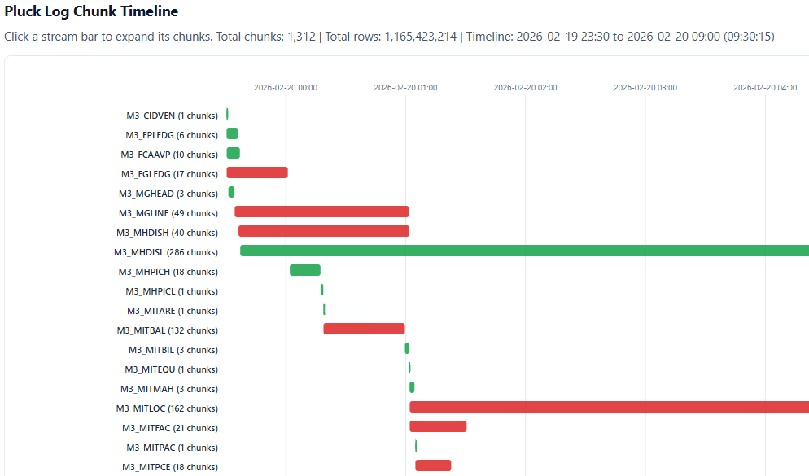

# plucklogviz

Small Python tool that turns pluck-style logs into an interactive Gantt HTML visualization.



## What It Shows

- Stream-level timeline bars
- Expandable chunk-level bars per stream
- Stream and chunk status coloring:
  - `running` (gray)
  - `complete` (green)
  - `error` (red)
- Rows processed and file-size totals in hover metadata
- Stream exceptions panel with:
  - formatted stack traces / exception text
  - `Copy exception` button (clipboard support with fallback)

## Requirements

- Python 3
- Optional: [`just`](https://github.com/casey/just) for helper commands in `justfile`

No external Python dependencies are required.

## Usage

Generate HTML directly:

```bash
python3 log_gantt.py pluck.log -o pluck_gantt.html
```

Optional title:

```bash
python3 log_gantt.py pluck.log -o pluck_gantt.html --title "Pluck Log Chunk Timeline"
```

Then open `pluck_gantt.html` in a browser.

## Input Expectations

The parser relies on log lines containing:

- A leading timestamp: `HH:MM:SS`
- `stream=...`
- `chunk=...` (for chunk windows)

It also uses:

- `rows=...` for per-chunk row counts
- `fileSizeKb=...` for file-size aggregation
- `run=YYYYMMDD_HHMMSS...` to anchor absolute date labels
- `fail:` to mark stream/chunk failures and capture exception lines
- `complete ===` to mark completed streams

If no lines contain both `stream=...` and `chunk=...`, generation fails with:

`No lines with both stream=... and chunk=... were found.`

## Interaction

- Click a stream bar to expand/collapse its chunks.
- Hover bars for quick metadata and exception context.
- In the **Stream Exceptions** section, use **Copy exception** to copy the full formatted exception text for a stream.

## justfile Shortcuts

If you use `just`, available recipes include:

- `just view` (or `just view logfile='your.log'`)
- `just open`
- `just view-prod` (environment-specific)
